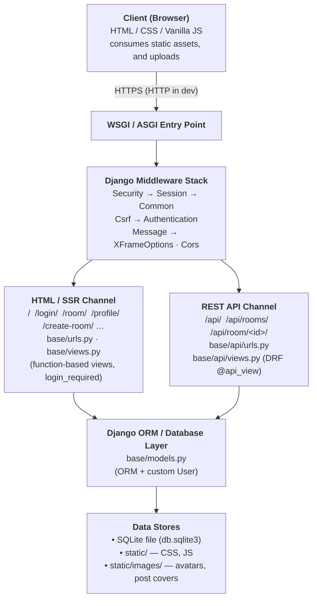
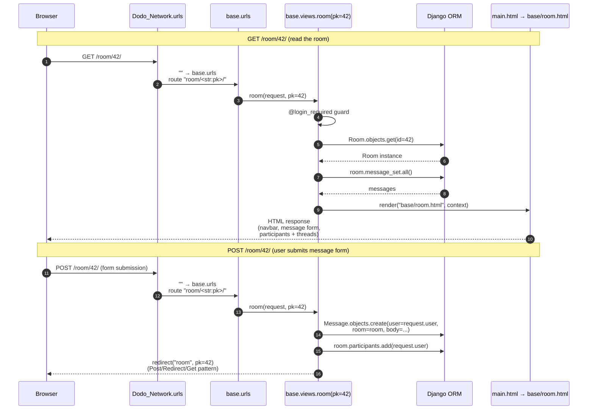
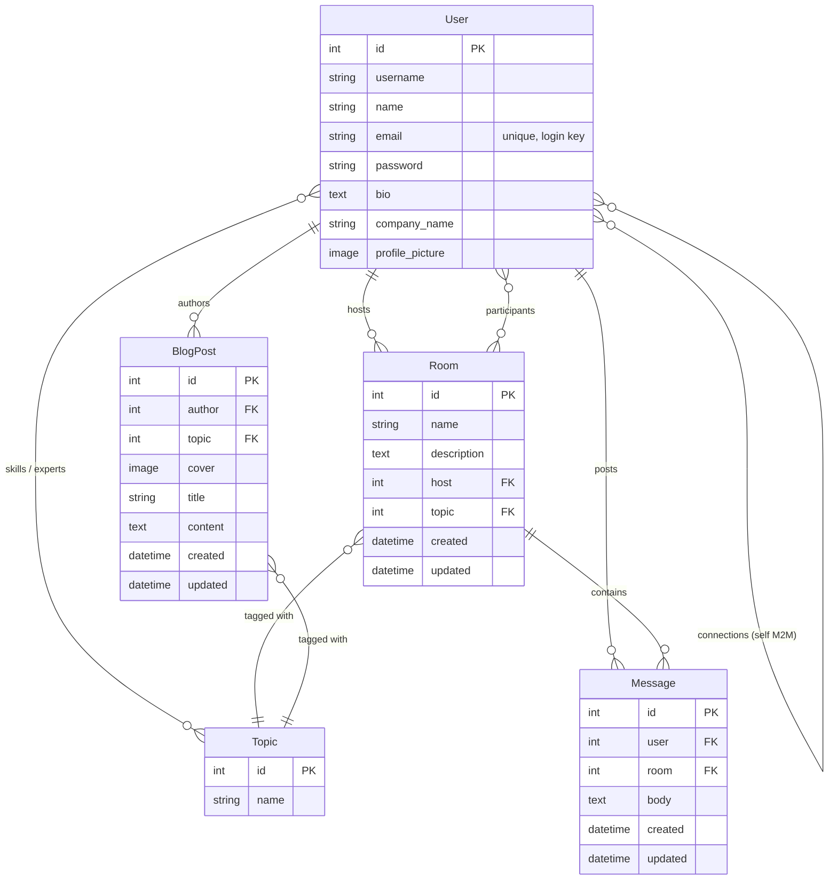

<div align="center">

# Dodo Network

### _A Social Network Built for Professionals_

</div>

<div align="center">

[](https://www.djangoproject.com/)
[](https://www.python.org/)
[](https://www.django-rest-framework.org/)
[](https://www.sqlite.org/)

</div>

---

## 📑 Table of Contents

- [Overview](#-overview)
- [Features](#-features)
- [Screenshots](#-screenshots)
- [Tech Stack](#-tech-stack)
- [System Architecture](#-system-architecture)
- [Data Model](#-data-model)
- [URL & Routing Map](#-url--routing-map)
- [Installation & Setup](#-installation--setup)
- [Running the App](#-running-the-app)
- [Creating the Superuser & Admin Panel](#-creating-the-superuser--admin-panel)
- [Development Workflow](#-development-workflow)
- [Contributing](#-contributing)

---

## Overview

**Dodo Network** is a full‑stack, server‑rendered **social network for professionals** that lets users discover communities, hold real‑time discussions, publish long‑form blog posts, and connect with peers around shared areas of expertise.

Inspired by developer community platforms such as the DEV Community, Dodo Network packages the same ideas including topic‑curated feeds, threaded discussion rooms, activity streams, profiles, and a blog into a single, self‑contained Django application.

---

## ✨ Features

### 👤 Accounts & Profiles

- Email‑based registration and login
- Personal profile page with avatar, name, username, bio, company, **skills**, and **connections**.
- Edit profile
- One‑click **Connect** with other professionals
- Browse a profile’s hosted **discussion rooms** or **blog posts** with a single toggle.

### 💬 Discussion Rooms

- Topic‑tagged discussion rooms with a name, description, host, and participants.
- Full **CRUD** for rooms (create, read, update, delete) — only the host can mutate.
- Threaded **messages** inside each room (create + delete)
- Live participant list and per‑room join counter.
- Recent‑activity sidebar showing the latest messages from your connections.

### 📝 Blog Posts

- Long‑form **Blog Posts** with title, body, optional cover image, and a topic.
- Full **CRUD** for posts (create, read, update, delete) — only the author can mutate.
- Posts are surfaced on the author’s profile.

### 🏷️ Topics & Skills

- Free‑text topic creation
- A topic can be associated with many experts via the user’s “Skills” picker.
- Browse all topics at `/topics/` with search.

### 🔍 Search

- Global search bar on the home page filters rooms by topic name, room name, or description.

### 🎨 UX & UI

- Responsive three‑column layout (Topics / Feed / Activity).
- Custom CSS theme and SVG icon set.
- Lightweight vanilla JS for dropdowns and the animated background.

---

## 📸 Screenshots

> Screenshots of the running application will be embedded below. Until then, a sample placeholder is shown — replace it with real captures of the app.

<table width="100%">
  <tr>
    <td width="50%" align="center">
      <p><b>Feed Home</b></p>
      
    </td>
    <td width="50%" align="center">
      <p><b>Room Conversation</b></p>
      
    </td>
  </tr>
  <tr>
    <td width="50%" align="center">
      <p><b>User Profile</b></p>
      
    </td>
    <td width="50%" align="center">
      <p><b>Login / Register</b></p>
      
    </td>
  </tr>
</table>

---

## 🧰 Tech Stack

| Layer          | Technology                                         |
| -------------- | -------------------------------------------------- |
| Language       | Python 3.x                                         |
| Web Framework  | Django 3.2.7                                       |
| API Framework  | Django REST Framework 3.12.4                       |
| CORS           | django-cors-headers 3.8.0                          |
| Database       | SQLite 3 (file‑based, see `db.sqlite3`)            |
| Templating     | Django Template Language (server‑rendered HTML)    |
| Forms          | Django `ModelForm` + `UserCreationForm` subclasses |
| Front‑end      | Vanilla HTML/CSS/JS, custom SVG icon set           |
| Media Handling | Pillow 12.0.                                       |

The pinned versions live in [`requirements.txt`](requirements.txt).

---

## 🏗️ System Architecture

Dodo Network follows the **classic Django MVT (Model–View–Template)** pattern with a thin REST layer bolted on for programmatic access. Below is a layered view of how a request flows through the system.



### Request Lifecycle Example: Posting a Message in a Room



---

## 🧬 Data Model



### Model Reference (`base/models.py`)

| Model      | Key Fields & Relationships                                                                                                                     |
| ---------- | ---------------------------------------------------------------------------------------------------------------------------------------------- |
| `User`     | Extends `AbstractUser`. Adds `name`, `email` (unique, login), `bio`, `company_name`, `profile_picture`. Self M2M `connections`.                |
| `Topic`    | `name`. M2M `experts` ↔ `User`.                                                                                                                |
| `BlogPost` | `author` (FK→User, CASCADE), `topic` (FK→Topic, SET_NULL), `cover`, `title`, `content`. Ordered by `[-updated, -created]`.                     |
| `Room`     | `host` (FK→User, SET_NULL), `topic` (FK→Topic, SET_NULL), `name`, `description`, `participants` (M2M→User). Ordered by `[-updated, -created]`. |
| `Message`  | `user` (FK→User, CASCADE), `room` (FK→Room, CASCADE), `body`. Ordered by `[-updated, -created]`.                                               |

---

## 🗺️ URL & Routing Map

### Project URLs (`Dodo_Network/urls.py`)

| Path           | Routes To                  |
| -------------- | -------------------------- |
| `admin/`       | Django admin               |
| `""`           | `base.urls`                |
| `"api/"`       | `base.api.urls`            |
| `static/media` | dev‑only `static()` helper |

### HTML URLs (`base/urls.py`)

| Path                         | View            | Name             | Login Required |
| ---------------------------- | --------------- | ---------------- | -------------- |
| `""`                         | `home`          | `home`           | indirect\*     |
| `"login/"`                   | `loginUser`     | `login`          | no             |
| `"logout/"`                  | `logoutUser`    | `logout`         | no             |
| `"register/"`                | `registerUser`  | `register`       | no             |
| `"profile/<str:pk>/"`        | `userProfile`   | `user-profile`   | yes            |
| `"update-user/"`             | `updateUser`    | `update-user`    | yes            |
| `"room/<str:pk>/"`           | `room`          | `room`           | yes            |
| `"create-room/"`             | `createRoom`    | `create-room`    | yes            |
| `"update-room/<str:pk>/"`    | `updateRoom`    | `update-room`    | yes (host)     |
| `"delete-room/<str:pk>/"`    | `deleteRoom`    | `delete-room`    | yes (host)     |
| `"delete-message/<str:pk>/"` | `deleteMessage` | `delete-message` | yes (author)   |
| `"create-post/"`             | `createPost`    | `create-post`    | yes            |
| `"update-post/<str:pk>/"`    | `updatePost`    | `update-post`    | yes (author)   |
| `"delete-post/<str:pk>/"`    | `deletePost`    | `delete-post`    | yes (author)   |
| `"add-skill/<str:pk>/"`      | `addSkill`      | `add-skill`      | yes            |
| `"connect/<str:pk>/"`        | `connect`       | `connect`        | yes            |
| `"topics/"`                  | `listTopics`    | `topics`         | yes            |
| `"activity/"`                | `showActivity`  | `activity`       | yes            |

\* `home` redirects unauthenticated users to `login` via an inline check.

### API URLs (`base/api/urls.py`)

| Path               | View        |
| ------------------ | ----------- |
| `""`               | `getRoutes` |
| `"rooms/"`         | `getRooms`  |
| `"room/<str:pk>/"` | `getRoom`   |

---

## ⚙️ Installation & Setup

### 1. Clone the repository

```bash
git clone https://github.com/Mir-Ilham/Dodo-Network.git
cd Dodo-Network
```

### 2. Create & activate a virtual environment

```bash
# Install virtualenv if you don't have it
pip install virtualenv

# Create the environment
virtualenv envname

# Activate it
# macOS / Linux
source envname/bin/activate

# Windows (PowerShell)
envname\Scripts\Activate.ps1

# Windows (cmd)
envname\Scripts\activate
```

### 3. Install the pinned dependencies

```bash
pip install -r requirements.txt
```

### 4. Apply migrations

```bash
python manage.py migrate
```

### 5. (Optional) Create a superuser

```bash
python manage.py createsuperuser
```

You will be prompted for username, email, and password. (Because `USERNAME_FIELD = "email"`, the form will accept an email address.)

### 6. Run the development server

```bash
python manage.py runserver
```

The app is now live at **http://127.0.0.1:8000/**.

---

## ▶️ Running the App

| Command                                   | Purpose                                                |
| ----------------------------------------- | ------------------------------------------------------ |
| `python manage.py runserver`              | Start the dev server on port 8000.                     |
| `python manage.py runserver 0.0.0.0:8000` | Listen on all interfaces (useful for LAN testing).     |
| `python manage.py makemigrations`         | Generate new migrations after model changes.           |
| `python manage.py migrate`                | Apply migrations to the database.                      |
| `python manage.py createsuperuser`        | Create an admin account.                               |
| `python manage.py shell`                  | Open a Django shell for ad‑hoc ORM exploration.        |
| `python manage.py collectstatic`          | Bundle static files into `STATIC_ROOT` for production. |

---

## 🛡️ Creating the Superuser & Admin Panel

Once a superuser is created (`python manage.py createsuperuser`), visit **http://127.0.0.1:8000/admin/** to manage:

- `User` accounts
- `Topic` taxonomy
- `BlogPost` entries
- `Room` discussion groups
- `Message` entries

All five models are registered in `base/admin.py`.

---

## 🛠️ Development Workflow

1. **Pick a feature or bug.**
2. **Branch off `master`:**
   ```bash
   git checkout -b feature/awesome-thing
   ```
3. **Make your changes.** Match the existing code style (PEP 8 — `autopep8` and `pycodestyle` are pinned in `requirements.txt` for this reason).
4. **Run checks:**
   ```bash
   python manage.py check
   python manage.py makemigrations --check
   ```
5. **Commit and open a Pull Request** with a clear description and screenshots if UI‑related.

## 🤝 Contributing

Contributions, issues, and feature requests are welcome! Feel free to:

1. Fork the repository.
2. Create your feature branch (`git checkout -b feature/AmazingFeature`).
3. Commit your changes (`git commit -m 'Add some AmazingFeature'`).
4. Push to the branch (`git push origin feature/AmazingFeature`).
5. Open a Pull Request.

For major changes, please open an issue first to discuss what you would like to change.

---
